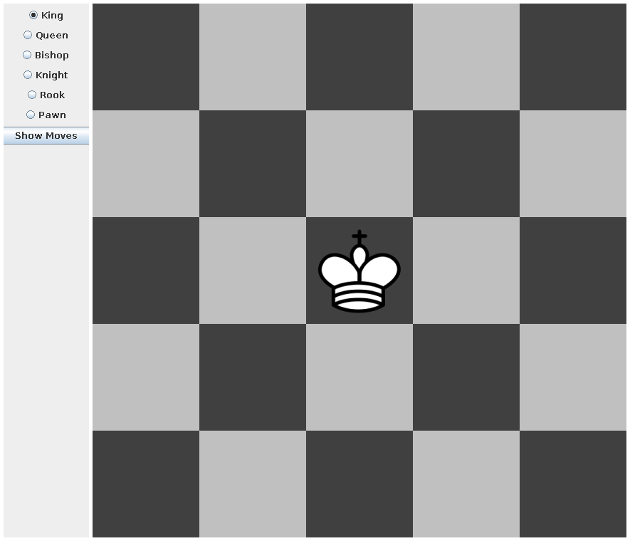

#Chess Pieces

## Screenshots

<!-- phantom:chess-board -->

<!-- /phantom:chess-board -->

Develop an application that demonstrates the possible moves for each type of chess piece in the game of chess. Develop a drawing area that draws a section of a chess board with 5 rows and 5 columns. Provide radio buttons that allow a user to select a chess piece. When a radio button is selected, draw the chess piece as an image icon (using the ImageIcon class) in the center of the chess board as shown below (left). Provide a button (“Show Moves”) to enable the display of the possible moves of the selected piece on the chess board as shown below (right).

You must demonstrate inheritance by developing a base chess piece class with which to derive classes representing each type of chess piece. You must also develop a class to represent the chess board. Finally, you must demonstrate polymorphism by overriding an abstract method in the base class that draws the possible moves on the chess board.

************************************************************************************************************************************************************
Sample run:
************************************************************************************************************************************************************

