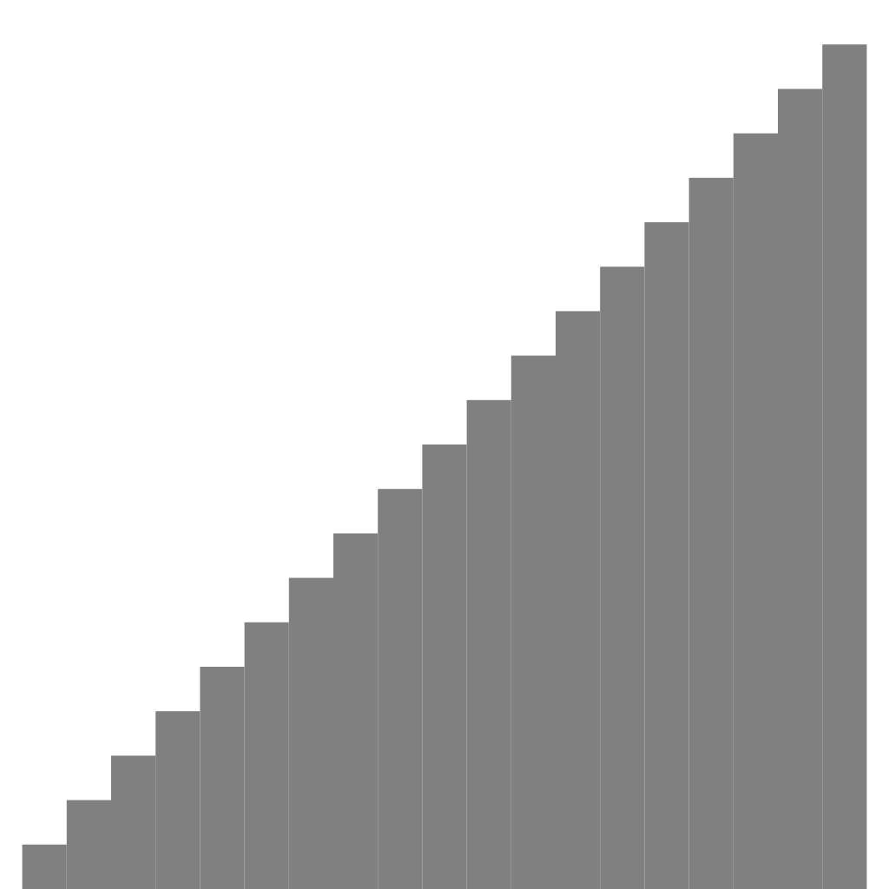

#Description

## Screenshots

<!-- phantom:insertion-sort -->

<!-- /phantom:insertion-sort -->

<!-- phantom:selection-sort -->

<!-- /phantom:selection-sort -->

##GraphicalInsertion.java

This program generates a randomly assorted array of double values from 1/N to 1. It then sorts them using the insertion sort method and draws a graphical representation of the process every step of the way.

************************************************************************************************************************************************************
Sample run:
************************************************************************************************************************************************************

    $ java GraphicalInsertion 20
  

##GraphicalSelection.java

This program generates a randomly assorted array of double values from 1/N to 1. It then sorts them using the selection sort method and draws a graphical representation of the process every step of the way.

************************************************************************************************************************************************************
Sample run:
************************************************************************************************************************************************************

    $ java GraphicalSelection 20
    

