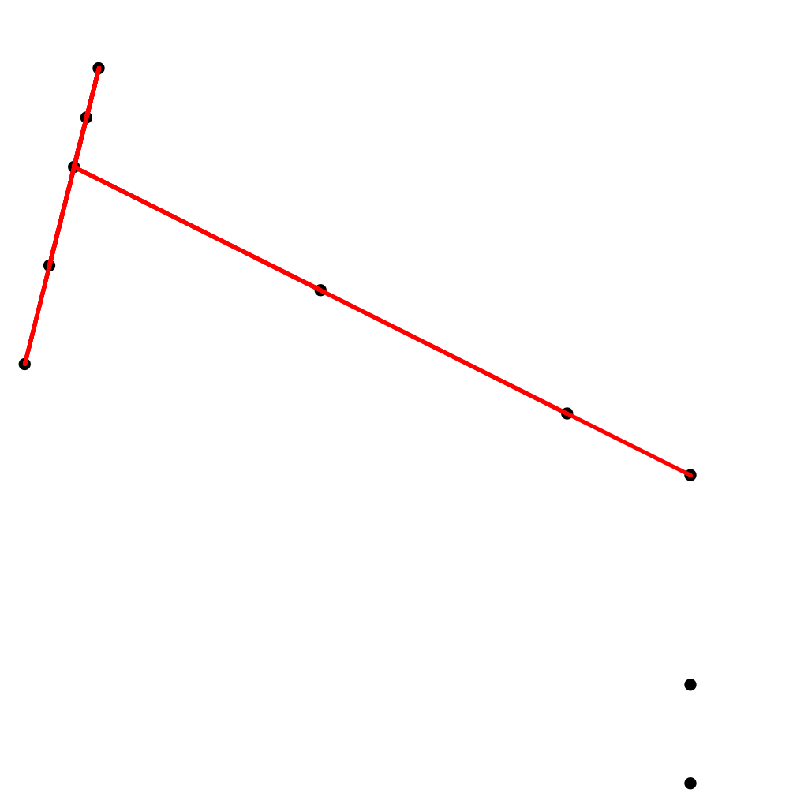

#Description

## Screenshots

<!-- phantom:collinear-points -->

<!-- /phantom:collinear-points -->

##Point.java

An immutable data type for points in the plane.

##Brute.java

This program reads in points on an xy-plane from a .txt file, processes them, and then finds all sets of 4 collinear points. It then lists all of these sets of collinear points and also graphs the points on a display plane and draws lines through them.

************************************************************************************************************************************************************
Sample run:
************************************************************************************************************************************************************

    $ java Brute < input10.txt

        4: (4000, 30000) -> (3500, 28000) -> (3000, 26000) -> (2000, 22000)
        4: (4000, 30000) -> (3500, 28000) -> (3000, 26000) -> (1000, 18000)
        4: (4000, 30000) -> (3500, 28000) -> (2000, 22000) -> (1000, 18000)
        4: (4000, 30000) -> (3000, 26000) -> (2000, 22000) -> (1000, 18000)
        4: (3500, 28000) -> (3000, 26000) -> (2000, 22000) -> (1000, 18000)
        4: (3000, 26000) -> (13000, 21000) -> (23000, 16000) -> (28000, 13500)
        
##Fast.java

This program reads in points on an xy-plane from a .txt file, processes them, and then finds all sets of 4 collinear points. It then lists all of these sets of collinear points and also graphs the points on a display plane and draws lines through them.

To differentiate form Brute.java however, this program uses sorting methods to alleviate the pain of searching for collinear points. Instead of manually checking all sets of points, we now only need to search an array of slopes (with reference to the origin point) one time, and in the event a specific slope appears 4 or more times, we know we have a line that fulfills our requirements. This program also employs a minimal representation check to eliminate the redundancy of the same set of points being represented by a different origin point.

************************************************************************************************************************************************************
Sample run:
************************************************************************************************************************************************************

    $ java Fast < input10.txt
    
        5: (1000, 18000) -> (2000, 22000) -> (3000, 26000) -> (3500, 28000) -> (4000, 30000)
        4: (28000, 13500) -> (23000, 16000) -> (13000, 21000) -> (3000, 26000)
