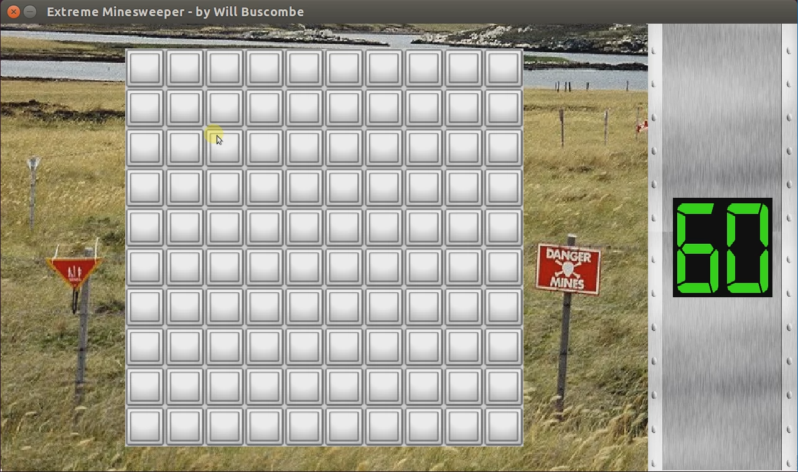
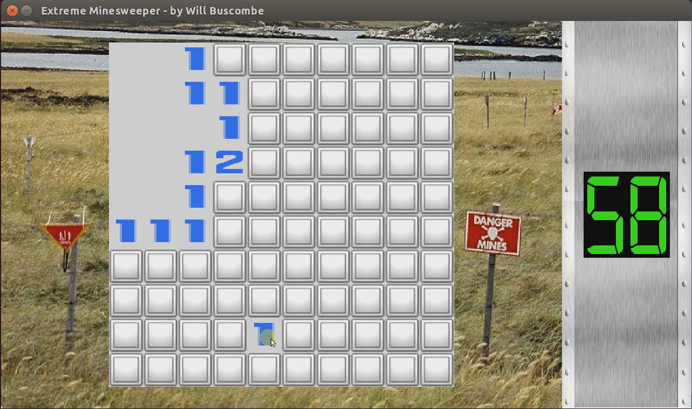
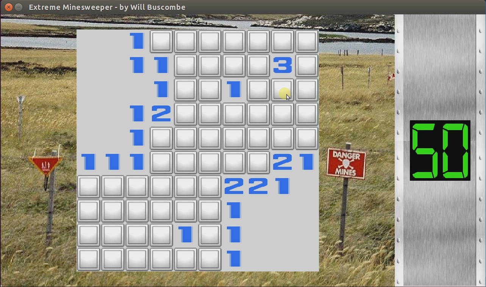
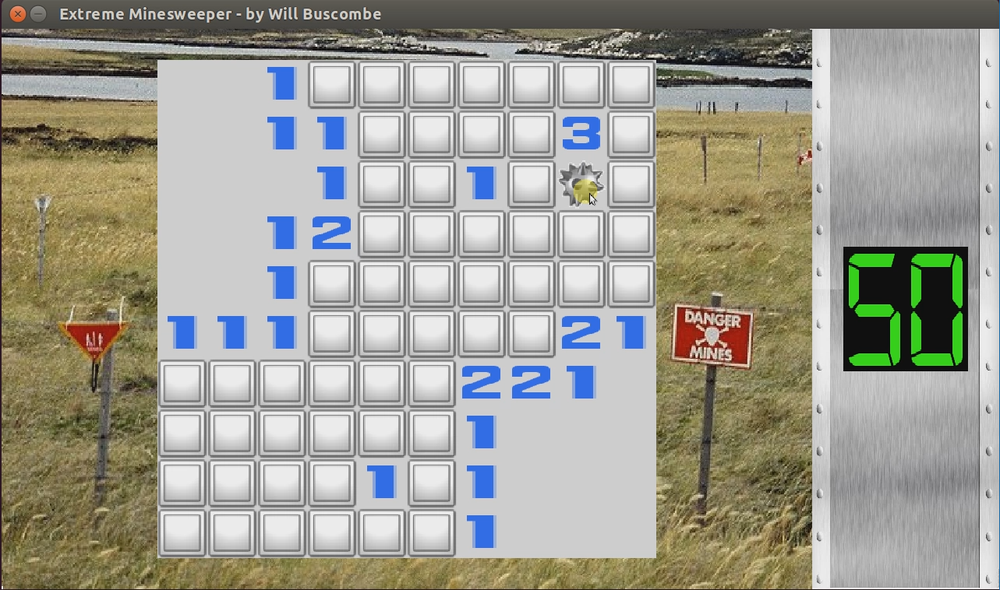

# Extreme Minesweeper

A Minesweeper clone built with SDL2 featuring a 60-second time limit, background music, and explosion animations.

## Features

- **Classic Minesweeper gameplay** - Click tiles to reveal numbers or mines
- **Time pressure** - 60-second countdown timer with color-changing display (green to red)
- **Audio** - Background music during gameplay, victory/defeat sound effects, explosion sounds
- **Visual effects** - Animated explosion when hitting a mine
- **Auto-reveal** - Clicking a zero tile automatically reveals adjacent safe tiles

## Screenshots

| Start | Mid-game | Victory |
|-------|----------|---------|
|  |  |  |




## Building

### Prerequisites

- C compiler (gcc or clang)
- SDL2, SDL2_image, SDL2_ttf, SDL2_mixer

### Linux (Ubuntu/Debian)

```bash
sudo apt-get install libsdl2-dev libsdl2-image-dev libsdl2-ttf-dev libsdl2-mixer-dev
make
./project03_01
```

### macOS (Homebrew)

```bash
brew install sdl2 sdl2_image sdl2_ttf sdl2_mixer
make
./project03_01
```

### Windows (MSYS2)

```bash
pacman -S mingw-w64-x86_64-SDL2 mingw-w64-x86_64-SDL2_image mingw-w64-x86_64-SDL2_ttf mingw-w64-x86_64-SDL2_mixer
make
./project03_01.exe
```

### Pre-built Binaries

Pre-built executables for Linux, macOS, and Windows are available from [GitHub Actions](../../actions/workflows/build-minesweeper.yml). Download the artifact for your platform from the latest successful build.

## Game Assets

| File | Description |
|------|-------------|
| `grid_panel.bmp` | Main game board background |
| `clock_panel.bmp` | Timer panel background |
| `tile.bmp` | Unrevealed tile sprite |
| `mine.bmp` | Mine sprite |
| `explosion.png` | Explosion animation sprite sheet |
| `digital-7.ttf` | Clock display font |
| `Carre.ttf` | Tile number font |
| `game_loop.wav` | Background music |
| `victory.wav` | Win sound effect |
| `defeat.wav` | Lose sound effect |
| `explosion.wav` | Mine explosion sound |

## Controls

- **Left click** - Reveal a tile
- **Any key** - Exit after game over

## Configuration

Grid size and mine count can be adjusted in `main.c`:

```c
#define GRID_ROWS 10
#define GRID_COLS 10
#define MINES ((int) ((5.0 / 32.0) * ((GRID_ROWS * GRID_COLS) / 1.0)))
#define MAX_TIME 60
```

## Original Assignment

This was created for an Intermediate C Programming course assignment to implement a classic arcade game using SDL2. The original assignment allowed choosing from games like Asteroids, Pac-Man, Space Invaders, etc. Minesweeper was chosen with the added feature of a countdown timer for increased difficulty.

## License

Educational project - freely available for learning purposes.
