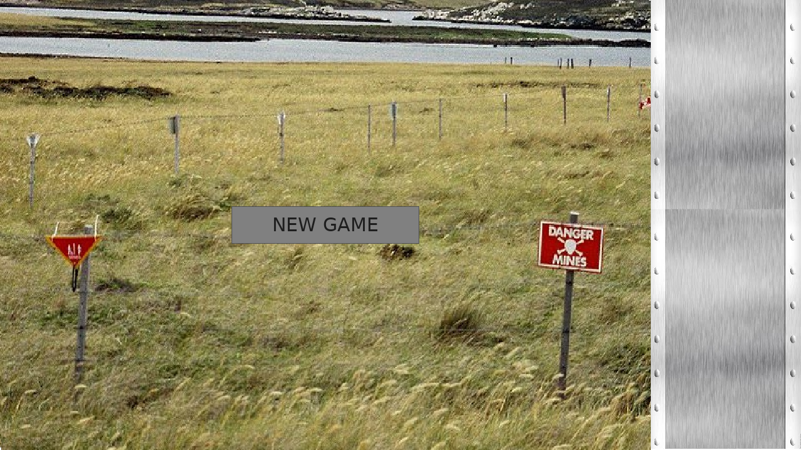
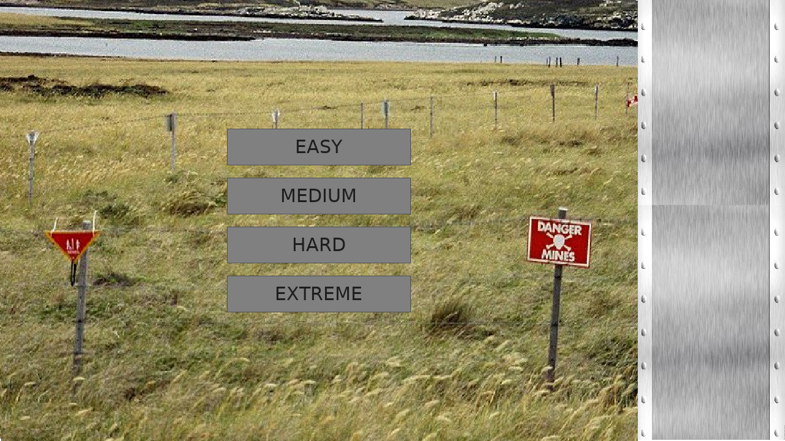
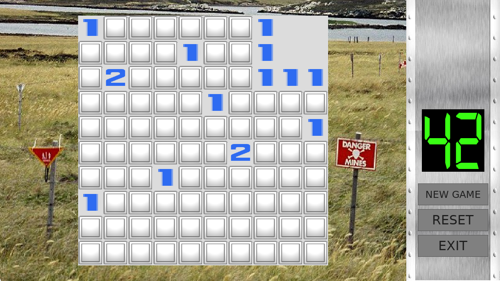
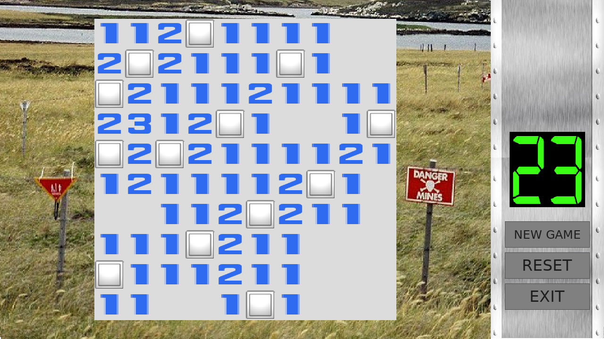

# Extreme Minesweeper

A Minesweeper clone built with SDL2 featuring multiple difficulty levels, time pressure gameplay, and an EXTREME+ challenge mode.

## Features

- **Classic Minesweeper gameplay** - Click tiles to reveal numbers or mines
- **Four difficulty levels**:
  - Easy (120 seconds)
  - Medium (90 seconds)
  - Hard (60 seconds)
  - Extreme (30 seconds)
- **EXTREME+ Mode** - Beat Extreme and keep pushing your limits with decreasing time
- **Time pressure** - Countdown timer with color-changing display (green to red)
- **Audio** - Background music during gameplay, victory/defeat sound effects, explosion sounds
- **Visual effects** - Animated explosion when hitting a mine
- **Auto-reveal** - Clicking a zero tile automatically reveals adjacent safe tiles
- **In-game menu** - NEW GAME, RESET, and EXIT buttons always available

## Screenshots

<!-- phantom:main-menu -->

<!-- /phantom:main-menu -->

<!-- phantom:difficulty-select -->

<!-- /phantom:difficulty-select -->

<!-- phantom:mid-game -->

<!-- /phantom:mid-game -->

<!-- phantom:game-over -->

<!-- /phantom:game-over -->

<!-- phantom:victory -->

<!-- /phantom:victory -->

## Downloads

### Pre-built Binaries

Go to the [Releases page](../../releases) to download:

#### Windows
- **`Minesweeper-Setup.exe`** - Installer (recommended)
  - Creates Start Menu and Desktop shortcuts
  - Adds uninstaller to Control Panel
- **`minesweeper-windows.zip`** - Portable version
  - Extract anywhere and run `Play.bat`
  - No installation required

#### macOS
- **`minesweeper-macos-app.zip`** - App Bundle
  - Extract and drag `Extreme Minesweeper.app` to Applications
  - Requires SDL2: `brew install sdl2 sdl2_image sdl2_ttf sdl2_mixer`
- **`minesweeper-macos.zip`** - Standalone folder
  - For users who prefer running from terminal

#### Linux
- **`minesweeper-linux.tar.gz`** - Tarball with install script
  - Extract and run `./install.sh` for system installation
  - Or run `./minesweeper.sh` directly
- **`minesweeper-linux.zip`** - ZIP archive
- Requires SDL2:
  - Ubuntu/Debian: `sudo apt install libsdl2-2.0-0 libsdl2-image-2.0-0 libsdl2-ttf-2.0-0 libsdl2-mixer-2.0-0`
  - Fedora: `sudo dnf install SDL2 SDL2_image SDL2_ttf SDL2_mixer`
  - Arch: `sudo pacman -S sdl2 sdl2_image sdl2_ttf sdl2_mixer`

### Development Builds

The latest development builds are available from [GitHub Actions](../../actions/workflows/build-minesweeper.yml).

## Building from Source

### Prerequisites

- C compiler (gcc or clang)
- SDL2, SDL2_image, SDL2_ttf, SDL2_mixer development libraries

### Linux (Ubuntu/Debian)

```bash
sudo apt-get install libsdl2-dev libsdl2-image-dev libsdl2-ttf-dev libsdl2-mixer-dev
make
./minesweeper
```

### macOS (Homebrew)

```bash
brew install sdl2 sdl2_image sdl2_ttf sdl2_mixer
make
./minesweeper
```

### Windows (MSYS2)

```bash
pacman -S mingw-w64-x86_64-SDL2 mingw-w64-x86_64-SDL2_image mingw-w64-x86_64-SDL2_ttf mingw-w64-x86_64-SDL2_mixer
make
./minesweeper.exe
```

## Controls

- **Left click** - Reveal a tile
- **NEW GAME** - Return to difficulty selection
- **RESET** - Restart current game with same difficulty
- **EXIT** - Close the game
- **ESC** - Close the game

## EXTREME+ Mode

After beating EXTREME mode (30 seconds), you'll be challenged to "GET MORE EXTREME?"

- Accepting reduces your time by 5 seconds (down to 20 seconds)
- Below 20 seconds, time reduces by 2 seconds each win
- RESET keeps your current EXTREME+ time
- Keep going until you beat the game with just 2 seconds!
- Victory at 2 seconds reveals the ultimate ending: **"CONGRATURATION."**

## Configuration

Grid size and mine count can be adjusted in `main.c`:

```c
#define GRID_ROWS 10
#define GRID_COLS 10
#define MINES ((int) ((5.0 / 32.0) * ((GRID_ROWS * GRID_COLS) / 1.0)))
```

## Game Assets

| File | Description |
|------|-------------|
| `grid_panel.bmp` | Main game board background |
| `clock_panel.bmp` | Timer panel background |
| `tile.bmp` | Unrevealed tile sprite |
| `mine.bmp` | Mine sprite |
| `explosion.png` | Explosion animation sprite sheet |
| `digital-7.ttf` | Clock display font |
| `Carre.ttf` | Tile number font |
| `game_loop.wav` | Background music |
| `victory.wav` | Win sound effect |
| `defeat.wav` | Lose sound effect |
| `explosion.wav` | Mine explosion sound |

## Version History

### v2.0.0
- Added main menu and difficulty selection
- Added four difficulty levels (Easy, Medium, Hard, Extreme)
- Added EXTREME+ progressive challenge mode
- Added NEW GAME, RESET, and EXIT buttons
- Added "CONGRATURATION" ending (Ghosts 'n Goblins reference)
- Windows installer with Start Menu shortcuts
- macOS App Bundle support
- Linux install script

### v1.1.0
- Fixed app freeze on game over
- Added Play Again button
- Fixed memory leaks
- Cross-platform CI/CD builds

### v1.0.0
- Original release for Intermediate C Programming course

## Original Assignment

This was created for an Intermediate C Programming course assignment to implement a classic arcade game using SDL2. The original assignment allowed choosing from games like Asteroids, Pac-Man, Space Invaders, etc. Minesweeper was chosen with the added feature of a countdown timer for increased difficulty.

## License

Educational project - freely available for learning purposes.
